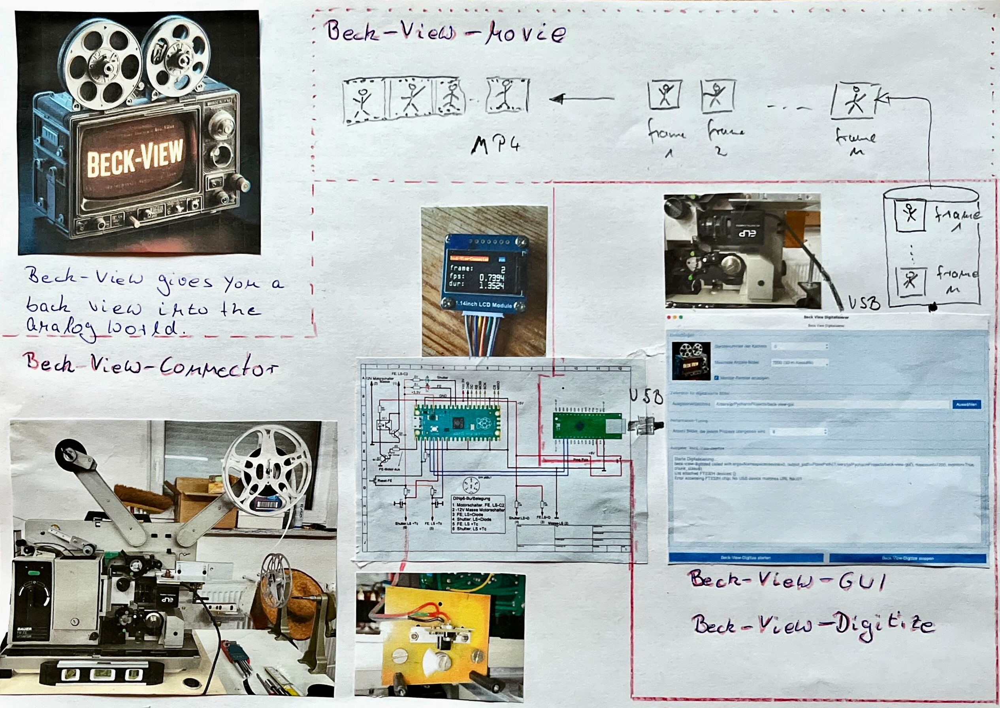

# Beck View Connector

**Beck View Connector** is a sub-project of the [Beck View Digitize](https://github.com/JuPfu/beck-view-digitize) project. This component serves as an intermediary between the photoelectric sensors attached to the film projector and the computer running Beck View Digitize. It enables the detection, synchronization, and handling of frame advancements and end-of-film events, with real-time data displayed on a connected TFT screen.


*Image: Prototype of the Beck View Connector, positioned between the film projector and [Beck View Digitize](https://github.com/JuPfu/beck-view-digitize) 

---

## Overview

[beck-view-connector](https://github.com/JuPfu/beck-view-connector) interfaces with the photoelectric sensors that generate frame advance and end-of-film signals. These signals are then transmitted to the computer running [beck-view-digitize](https://github.com/JuPfu/beck-view-digitize). The compiled [beck-view-connector](https://github.com/JuPfu/beck-view-connector) firmware must be flashed to a Raspberry Pi Pico, which processes these signals and forwards them appropriately.



## Features

**Frame Advancement Detection:**
A photoelectric sensor detects when the film's [rotating shutter](https://github.com/user-attachments/assets/5ff01cb6-593f-48e8-9ff4-b41a6fde65f2) no longer blocks the sensor, indicating a stable frame position in front of the projector lens. The frame advance signals are passed to [Beck View Digitize](https://github.com/JuPfu/beck-view-digitize), ensuring synchronization with the camera capturing the film frames.

A photoelectric sensor triggers when a [rotating shutter](https://github.com/user-attachments/assets/5ff01cb6-593f-48e8-9ff4-b41a6fde65f2) does not block the sensor any more, which coincides with the current frame at rest in front of the film projector lens.
The frame advance signals from the photoelectric sensor are passed on to [Beck View Digitize](https://github.com/JuPfu/beck-view-digitize). Each frame advance signal is held for 8ms. Based on the frame advance signals [Beck View Digitize](https://github.com/JuPfu/beck-view-digitize) triggers the camera mounted in front of the film projector lens.

**Process Details**

The projector shutter has a single blade covering approximately 70 degrees of a full 360-degree rotation.

* At a maximum speed of 24 frames per second (FPS), the total duration per frame is 41.67 ms.

* The shutter blade covers the lens for 8.10 ms (calculated as 41.67 ms * 70 / 360).

* When the blade starts blocking the lens, a rising edge signal is emitted.

* The system enforces a rising edge debounce delay of 2000 µs to filter out false triggers.

* When the lens is uncovered, a falling edge signal is emitted, and the frame advance signal is sent to the FT232H chip.

* The signal remains high for 8000 µs.

* The falling edge debounce delay ensures no additional interrupts occur while the frame advance signal is active.

**End-of-Film Detection:**  
A second photoelectric sensor is used to detect the end of film. The end of film signal is passed on to [Beck View Digitize](https://github.com/JuPfu/beck-view-digitize). The end of film signal is held for 1 second. On receiving the end of film signal [Beck View Digitize](https://github.com/JuPfu/beck-view-digitize) terminates.

**Real-Time Display:**  
Integrates with an ILI9341 TFT screen to provide frame timing, frames-per-second (FPS), and other statistics. The frame count displayed on the TFT screen after end of film is reached can be compared with the number of frames stored on disc.

**Debounced GPIO Handling:**  
Ensures stable signal processing with debouncing for all GPIO pin events.

**Dual-Core Utilization:**  
Leverages both cores of the Raspberry Pi Pico, dedicating one core for display updates.

**Customizable Timing Configurations:**  
Configurable delays for frame and end-of-film signal processing.

**Modular and Extensible:**  
Designed with a modular structure to allow easy integration and future enhancements.

---

## Requirements

**Hardware:**

- Raspberry Pi Pico
- ILI9341 TFT Display (or compatible display)
- A photoelectric sensor to trigger frame advance signals and a photoelectric sensor to emit an end-of-film signal
- GPIO wiring

**Software:**

- Recommended IDE for this sub-project is Visual Studio Code 
- The plugin <em>Raspberry Pi Pico</em> which also cares for the installation of a compatible toolchain for Raspberry Pi Pico (e.g., `arm-none-eabi-gcc`)

---

## Setup and Installation

### 1. Clone the Repository

  ```bash
  git clone https://github.com/JuPfu/beck-view-connector.git
  cd beck-view-connector
  ```

### 2. Build the Project

Ensure the **Pico SDK** is set up and its environment variables are configured. Then:

  ```bash
  mkdir build
  cd build
  cmake ..
  make
  ```

### 3. Flash to the Raspberry Pi Pico

After building, flash the `beck-view-connector.uf2` file to your Pico:

1. Hold the **BOOTSEL** button on the Pico while plugging it into your computer.
2. Copy the `.uf2` file onto the Pico's storage device.

  ---

## GPIO Configuration

  | GPIO Pin | Function                                              |
  |----------|-------------------------------------------------------|
  | 0        | Set permantly high on EOF to stop the projector motor |
  | 1        | Reset pin set high on button press                    |
  | 2        | Pass on Frame Advance Signal to FT232H controller     |
  | 3        | Pass on End-of-Film Signal to FT232H controller       |
  | 4        | Frame Advance Signal Input                            |
  | 5        | End-of-Film Signal Input                              |
  | 26       | LED lit on Frame Advance Signal                       |
  | 27       | LED lit on End-of-Film Signal                         |

  ---

## Usage

**Observe Display:** The TFT screen will display real-time frame information and indicate when the film ends.

---

## Key Components

### Core Functionalities:

- **`advance_frame_signal_isr`**: Handles frame advance signal processing.
- **`end_of_film_signal_isr`**: Manages end-of-film detection.
- **`update_display`**: Protothread for refreshing the display with timing and status updates.

### Protothread System:

Leverages a lightweight threading system for efficient multitasking.

### Timing Configurations:

- `FRAME_ADVANCE_DELAY_US`: Delay to maintain the frame advance signal.
- `END_OF_FILM_DELAY_US`: Delay to maintain the end-of-film signal.
- `DEBOUNCE_DELAY_US`: Debounce timing for signal edges.

---

## Project Structure

```plaintext
beck-view-connector/
├── .vscode/                 # Configuration files for Visual Studio Code
├── examples/                # Example applications or usage scenarios
├── extra/                   # Additional resources or utilities
├── include/
│   └── st7789/              # Header files for the ST7789 display driver
├── st7789/                  # Source files for the ST7789 display driver
├── .gitignore               # Specifies files to ignore in version control
├── CMakeLists.txt           # Build configuration file for CMake
├── README.md                # Project documentation
├── beck_view_connector.cpp  # Main implementation file
├── display.cpp              # Display handling logic
├── display.h                # Header for display handling
├── frame_signal.pio         # PIO program for frame signal processing
├── frame_timing.c           # Frame timing calculations
├── frame_timing.h           # Header for frame timing calculations
├── pico_sdk_import.cmake    # CMake script to import the Pico SDK
├── pt_v1_3.h                # Protothreading system header
└── types.h                  # Type definitions used across the project
```

---

## Contribution

Contributions are welcome! Please fork the repository, create a feature branch, and submit a pull request.

---

## License

This project is licensed under the **MIT License**. See the [LICENSE](LICENSE) file for details.

---

## Acknowledgments

- The **Raspberry Pi Foundation** for the hardware and SDK.
- The open-source community for providing valuable tools and libraries.

For more details on the parent project, visit the [Beck View Digitize repository](https://github.com/JuPfu/beck-view-digitize).

  ---
